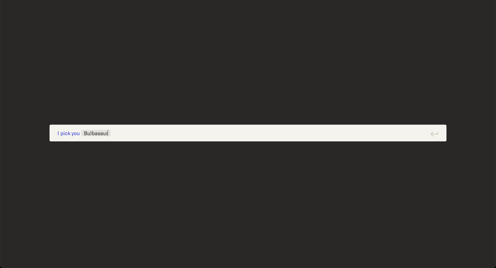
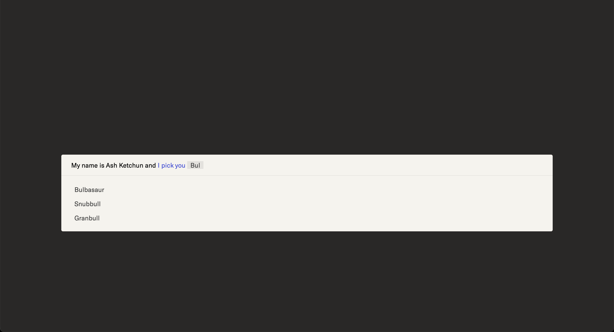

# Autocomplete

As a prerequisite, you need to have [pnpm](https://pnpm.io/) installed.

## How to run

```sh
pnpm dev
```

Try to type:

```sh
My name is Ash Ketchun and I pick you Bulbasaur
```

it should show something similar to it:



## How to build

Execute the command below:

```sh
pnpm build
```

## Screenshots

### Empty autocomplete

<details>
<summary>Click to expand</summary>


</details>

### Autocomplete with suggestions

<details>
<summary>Click to expand</summary>



</details>

### Filled autocomplete

<details>
<summary>Click to expand</summary>


</details>
